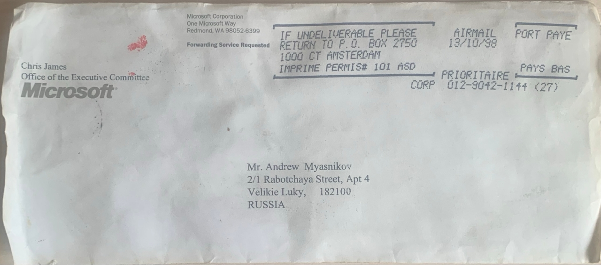
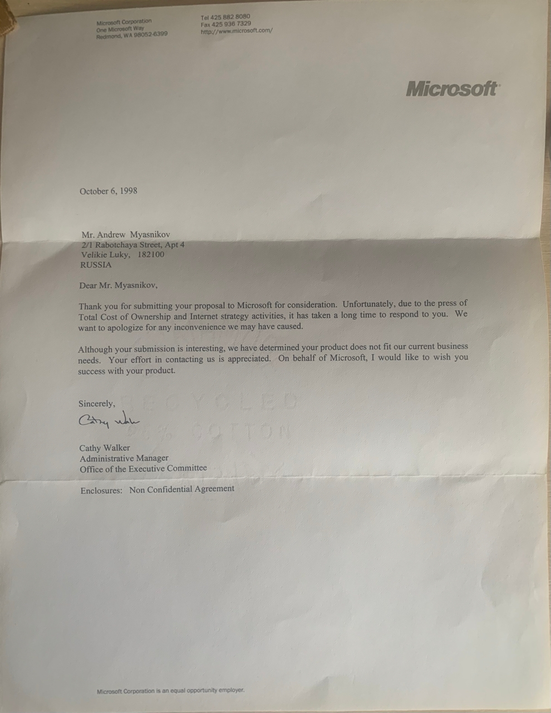

# Grabit — The Idea Microsoft Rejected in 1998

> I built a push-indexing prototype in rural Russia. Microsoft said no. Two decades later, the industry built it.

In October 1998, an envelope from Redmond, Washington, landed in my mailbox in Velikiye Luki. Inside was a five-line letter: *"Although your submission is interesting, we have determined your product does not fit our current business needs."* It was a reply to my letter, in which I had pitched one idea to Microsoft.

But let's start from the beginning.

My name is Andrey. I'm from a small town called Velikiye Luki in Russia. I'm 47 years old now. I work as a programmer and system administrator at a state educational institution. Not long ago, while sorting through old papers, I came across a letter dated 1998. I read it, remembered its story, and decided to tell it to you. I think it will interest many readers. At least, I hope so.

I will tell this story from beginning to end. It will take a little more than ten minutes, but I promise — at the end there will be food for thought.

I don't have a copy of the letter I sent to Microsoft — only their reply. Formally, any story could be fitted to that reply. I understand how it looks. I cannot prove that my proposal was exactly what I am about to describe. But I will tell everything the way I remember it, and I will show where I had doubts. The decision is yours.

---

## Table of Contents

- [The Beginning](#the-beginning)
- [A Little About Me](#a-little-about-me)
- [The Birth of the Idea](#the-birth-of-the-idea)
- [The Technical Part](#the-technical-part)
- [The Letter to Microsoft](#the-letter-to-microsoft)
- [Grabit](#grabit)
- [Yandex and the Provider](#yandex-and-the-provider)
- [28 Years Later](#28-years-later)
- [Final](#final)

---

## The Beginning

Back then, I was about twenty. I was a student at a local economics institute. Like most young people of that time, I was into computers. I had a ZX Spectrum and an Iskra. Around 1995, I got a Pentium 60. It was a time of experimenting with different programming languages and with all the new possibilities that were available back then.

And, of course, the internet. I got connected sometime in 1997–1998. Back then, the internet was slow and, I would say, a bit empty. Although websites were already appearing, finding them was quite an art. How do you search? It was 1998! At the time, I had access to search engines like Lycos and Yahoo. Yahoo was still just a directory that webmasters filled in themselves. In the Russian segment, Rambler appeared first (1996), then Yandex (1997). And in the global internet, the current giant Google appeared that same year, in 1998. It was the wild era of dial-up! If you remember that technology, you know what I mean.

In general, 1996–1998 were the formative years for both the internet and search technologies. According to Netcraft, there were only about 19,000 websites in the world in 1995. By 1998, that number had grown to 2.4 million. Most of them were static HTML pages that were updated rarely — sometimes once a month, sometimes even less often. You would think that with such a small number of sites, search should not have been a problem. And yet it was.

## A Little About Me

A few more words about myself. This is not just a detail — it may be the starting point of the whole story. Since childhood, I have suffered from VVD. Some call it a neurosis. In that state, I constantly asked myself two questions: How? and Why?

More about the diagnosis

In the International Classification of Diseases, there is no such single diagnosis, but there are two that describe this condition: F45.3 — somatoform autonomic dysfunction, and G90 — disorders of the autonomic nervous system. I won't go into all the details of this condition — if you're curious, you can Google it.

I believe this particular trait played its role in the story I am about to tell.

## The Birth of the Idea

One day, while browsing website directories and visiting Yahoo and Yandex, I started to wonder — how do they find sites to index? How costly is it? I began to dig into how it worked. Honestly, I don't remember where I learned about the technology of spiders (search robots). Perhaps from a few magazine articles of that time. Or perhaps it was just a guess — an assumption that something or someone must crawl websites and collect information for the search engine to index later.

For some reason, I really disliked that idea. Maybe it was the VVD spurring my thinking. Think about it: a huge number of computers in a search engine's data center crawling an enormous number of websites and pulling all their pages. That was a colossal waste of resources — both for the search engines and for the websites themselves. And traffic was expensive back then. And what about keeping information up to date? There were two options: either the search engine visited often and devoured traffic, or it visited rarely and you had to live with outdated information in its index. The more I learned, the stronger the feeling became: there had to be a more efficient way.

My mind, and partly my VVD, reacted strongly: this was no good. It was as absurd as a mailman walking door-to-door every day asking, "Do you have anything to send?" instead of just waiting for people to bring their letters to the post office.

Back then, I did not know this was called pull architecture. I just felt the current architecture was not optimal. Now I understand my idea was an attempt to flip pull and create push.

And so, in an instant, the idea was born. I started from the assumption that most websites at the time were static. Or, let's say, pseudo-dynamic. Those simply generated a static page file after some information in a database changed. By the way, many of my acquaintances who manage industry portals still do this today. Most of the site is pure static content that gets regenerated after changes in the database. Or, alternatively, on a schedule. I did not consider purely dynamic sites back then. But I suppose an adequate technical solution could have been found for them too.

## The Technical Part

A few words on how I saw the technical solution back then — not to bore you. I was genuinely trying to find a technical implementation of the idea. I dug through documentation, the internet, and SDKs.

So, how was the system supposed to work, and what was needed for it? By design, it needed to somehow detect changes in the site's file system and react to them. After some time, a scheme formed in my head. A certain program, a driver, would monitor the file system. As soon as it noticed changes in the directory belonging to the web server, it would catch the name of the changed file, map it to a URL, and prepare the file's content for sending — if it was an HTML file.

What does "prepare" mean? After receiving the names of changed or new files, the plan was to preprocess their content directly on the host: extract text, headings, links, tags, compress it all — and only then send it to the search engine.

After long searches on the internet over a dial-up connection (quite a quest!), I found two functions in Windows as candidates for implementing the idea. They were `FindFirstChangeNotification` and `ReadDirectoryChangesW`. The first one was ruled out immediately because it only gave the fact of a change without details. The second was more interesting for my task. It was very hard to find the necessary SDK, but I found it. After some small experiments with C++ code and these functions, I rejected this option too. I don't remember exactly why, but most likely because all the functionality took the form of a program with a visible interface. For some reason, I didn't like that. At the very least, it didn't feel universal if you looked at the whole technology from the point of view that it should work cross-platform in the future.

So I started digging in another direction. The choice fell on the DDK (Driver Development Kit). It also allowed directory monitoring, but as a driver. It was a bit more complicated in terms of code and its volume, but at the time it seemed like a more practical solution.

I chose Windows because it was the platform I knew, the one I could "touch." Microsoft felt like a natural candidate. I didn't think about Linux and Apache back then — not because they were worse, but because I was a kid from Velikiye Luki, and my world ended where Microsoft documentation ended.

It was a conscious choice in favor of the Microsoft ecosystem. Although I believe that with further project development, we would have found technical solutions for other platforms as well.

At the time, this solution to the problem felt the most logical to me. I wasn't trying to invent a new architecture, and of course I didn't know terms like push indexing, incremental indexing, or edge computing. Only many years later did I understand that these concepts now describe many elements of the idea I was trying to implement back then.

I didn't consider that scheme the only possible one. It was an idea with an attempt at implementation — a first approximation. If people with experience and money had been nearby, the architecture would surely have changed, maybe even for the better. But the essence — that the site itself would notify the search engine about changes — would have remained unchanged.

Even now, I can't say for sure whether VVD made me see that inefficiency, or whether the inefficiency I saw triggered another round of VVD. The cause-and-effect relationship is still unclear to me. But I know one thing for sure: once my brain latched onto a problem, there was no rest. I had to do something. Not because I was confident of success — but because stopping was impossible.

## The Letter to Microsoft

At the same time, I began thinking about how to turn this technology into reality. It was 1998.

The logic was simple. File monitoring? Windows? That meant Microsoft. I found a physical mailing address and wrote them a letter. I can't remember the exact dates now, but I believe it was in the summer of 1998. I briefly described the technology, its benefits, and sent it by mail. I no longer remember the exact wording — my original letter has not survived. But the essence was exactly as I described above. I sent it without any real hope of a reply, purely on a wave of enthusiasm.

And in October 1998, I received a reply. By regular ground mail.

*An envelope from Microsoft, October 1998. Return address — Redmond, Washington.*

Inside was a short letter. Just a few essential lines:

> "Although your submission is interesting, we have determined your product does not fit our current business needs."

In modern terms, I had been sent a polite "no thanks."

So Microsoft said no. But I felt the idea had potential. And I also understood that it couldn't be realized without a major partner.

Usually, after something like that, VVD can knock me out for a day or two. Emptiness, no energy, everything feeling forced. But that time, it didn't happen. My brain was already solving the next problem: "What if we try without Microsoft?" The question "How?" took over again.

## Grabit

What to do next? I started looking for venture investors. For my case, the term "venture investor" sounded a bit grand, but I began searching for sites where I could find them. And, surprisingly for that time, I found one. If I remember correctly, it was some kind of investor forum. Most likely private investors. I posted a message, left my contact details, and forgot about it. I didn't really believe in a result.

But after some time, I got a reply. It was from two private investors. As I recall, one of them was named David. We talked on the phone. We decided to try to bring the idea to life. We decided to name the company **Grabit!**

During the negotiations, I was also sorting out legal and organizational matters. Via Western Union, I received the first investment — a whole thousand dollars for development. I don't remember what I spent every cent on, but I remember buying a license for a compression library. Part of the money went to hiring a programmer who implemented basic functionality, and to access to the Win DDK.

There were also costs for a local lawyer and trips to the US embassy to get a visa. And this is where I honestly screwed up. When I arrived at the American embassy for my visa interview, I brought a lot of printed correspondence with my partner. And in one of those printouts was the phrase: *"If everything goes well, he will stay in the States."* Apparently, the embassy staff didn't like that phrase, and I didn't get the visa.

I left the embassy with a refusal in my passport and a feeling that the ground had disappeared from under my feet. Slightly devastated and lost, I stood there, not knowing where to go or what to do. People were passing by, each with their own business, with ordinary faces. It felt like it was all over — game over. Not so much hurt as empty. I held the folder with printouts and understood: Grabit, which David and I had come up with, had just died before it could even really be born. All because of one stupid phrase I had brought to the embassy myself. Then I pulled myself together and went home.

After that, this part of the story ended on its own. No visa — no continuation.

## Yandex and the Provider

But I didn't calm down. After some time, I started thinking about what to do next. I still felt the technology had potential. So I wrote to Yandex! It was just a little over a year old at the time. Since things didn't work out with Microsoft, I had to write to local search engines! After some time, I received a reply from them. It was more unexpected than the one from Microsoft. If my memory serves me right, it went something like: with this technology, you could hardly do anything except steal data from servers. I was slightly shocked.

I reread the letter twice. At first, I wanted to object — how could that be? I was offering them a way to save tons of traffic, and I got suspected of inventing a data theft tool. Then it became funny. Sad, but funny. Apparently, I had explained the idea in such a way that it seemed like a threat rather than help.

And still, I didn't want to end that correspondence. Remembering my contacts in the States, I decided to push back. With youthful naivety, I hinted that I might consider some kind of financing from my side (hoping for my American partners). They replied — well, if I had a couple of million dollars, then we could consider it. It was a half-joke. By the tone of the letter, it was clear: I wasn't being taken seriously. So Yandex of that time was worth a couple of million dollars? My contacts with Yandex ended there.

But I didn't stop there either. My last hope was some large national internet provider. I searched online and found a major provider from St. Petersburg. I don't remember its name now.

They also replied to my letter. They suggested a meeting. The meeting took place in some chess club in St. Petersburg. It was very short. The provider's representative listened to me, nodded, and said something like, "Interesting idea, we're planning to do something similar ourselves," although it was clear from his tone that he didn't really understand what I was talking about. We parted amicably, without promises.

We shook hands, and I left the chess club onto Nevsky Prospekt. It was already dark. Again, I had hit a wall. I felt great weariness and emptiness inside. I remember walking and thinking: "That's it. The third attempt — and a miss again." I had done everything I could under the conditions I had. The idea clearly did not want to come to life — at least not through me, and not in 1998. I didn't accept it right away, but that evening something inside me finally let the situation go.

That is how my attempts to bring the idea to life ended. Grabit never happened.

## 28 Years Later

More than 28 years have passed. I work as a system administrator, program in React and Node.js, live with the same VVD — sometimes it knocks me out for a day or two, but I'm used to it. And then, while sorting through old papers, I found that same letter from Microsoft.

And unexpectedly, I realized that the idea that once seemed to me just a logical technical solution had, over the years, acquired quite recognizable names.

Google arrived at a similar model with PubSubHubbub (now WebSub). Microsoft and Yandex launched the **IndexNow** protocol in 2021. Cloudflare built it into its platform and automatically notifies search engines about changes. And back then, in '98, everything could have gone differently.

I don't know whether the world reinvented what I had proposed. I don't know whether search development would have taken a different path if Microsoft had answered differently. History has no subjunctive mood. But when I look at modern cloud technologies and push notifications, I understand: the idea was right. It just came 15–20 years earlier than the world was ready to accept it.

I didn't earn a cent from this. I didn't become famous. I have no proof — only memory and that same letter. But it seems to me that's enough.

If you've read this far — thank you. And remember: sometimes what the world considers "not fitting into business interests" is just waiting for its time.

And yes, my VVD is still with me. It still makes me ask "How?" and "Why?" — even when my body rebels. And perhaps it was this very trait that helped me see back then what others didn't notice.

## Final

I will be glad if this story resonates. If it touched you, I would be grateful for a retweet. The tweet can be found here: [link to the tweet].

If there is a reader who sees this story as not just a retrospective but an opportunity for collaboration or a new project, I am open to proposals. After all, Grabit was never born, but who knows what might happen in another 28 years?

**My email:** [vlmal19781@gmail.com]
